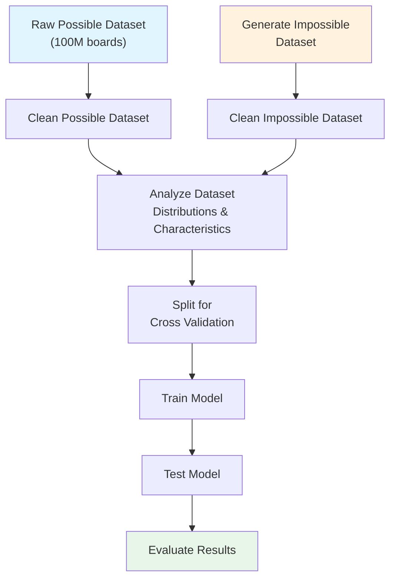

# ♟️ Simurgh: Chess Position Possibility Classification

## 🎯 Overview

I know what you are thinking — "oh no, not another chess project." But hear me out. 

While lots of work is dedicated to evaluating positions or legal moves, **I have yet to see a project evaluating possibilities**. 

Chess grandmasters can look at a board and determine whether such a game could exist. Their experience and pattern recognition allow them to assess whether a board state is **possible**. The distinction between **legal** and **possible** is crucial here.

> **Key Insight:** A state can be legal but impossible. For example, a specific pawn structure might follow all the rules of chess, but given the turn number, there's no possible sequence of moves that could produce this arrangement.

**Core Challenge:** Can I create a system that accurately classifies whether a given board state is possible?

---

## 📋 Problem Statement

| Aspect | Details |
|--------|---------|
| **Task** | Binary classification - Determine if a chess board state is possible or impossible |
| **Scope** | Identify states that are legal but unreachable (not structural illegality) |
| **Key Inputs** | Board state, Turn number |

---

##  Related Work

### Existing Approaches
- **Retrograde Analysis** - Focuses on pawn structure analysis
- **Proof Games** - Generates a history of how a game reached a position (computationally infeasible at scale)
- **Exhaustive Search** - Mathematical methods that search all possible game arrangements (again - computationally infeasible at scale)

### Key Resources
- [Natch Proof Game Solver](http://natch.free.fr/Natch.html)
- [Texel Proof Game Documentation](https://github.com/peterosterlund2/texel/blob/master/doc/proofgame.md)
- [Chess Neural Networks Research](https://theses.liacs.nl/pdf/2022-2023-AlwerSaleh.pdf)

**Note:** The problem is PSPACE-complete. A learned approximator cuts out the long computational process for each check, making this approach interesting.

---

## 📊 Dataset

| Type | Source | Status |
|------|--------|--------|
| **Possible states** | [Hugging Face - 100M Random Chess Boards](https://huggingface.co/datasets/lapp0/100M_random_chess_boards) | ✓ Available |
| **Impossible states** | To be generated | ⏳ In progress |

---

## ⚠️ Predicted Impossibility Types

The system should detect the following types of impossible board states:

1. **Pawn Structure Violation** 
   - Impossible pawn configurations given the move history

2. **State Beyond Turn Number Possibility** 
   - Board state unreachable within the given number of turns

3. **Piece Mobility Violations** 
   - Piece configurations that contradict piece movement rules over time

---

## 🔄 Data Pipeline

---

## 🚀 Additional Goals

- [ ] Create a web interface for position evaluation
- [ ] Deploy as a hosted website for public access
- [ ] Integrate legal move validation alongside possibility checks