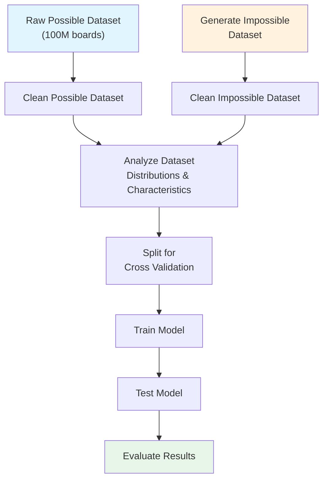

# Simurgh: Chess Position Possibility Classification

## Overview

I know what you are thinking — "oh no, not another chess project." But hear me out. 

While lots of work is dedicated to evaluating positions or legal moves, I have yet to see a project evaluating **possibilities**. 

Chess grandmasters can look at a board and determine whether such a game could exist. Their experience and pattern recognition allow them to assess whether a board state is **possible**. The distinction between **legal** and **possible** is crucial here.

> A state can be legal but impossible. For example, a specific pawn structure might follow all the rules of chess, but given the turn number, there's no possible sequence of moves that could produce this arrangement.

This is the core challenge of Simurgh: **Can I create a system that accurately classifies whether a given board state is possible?**

## Problem Statement

**Task:** Binary classification - Determine if a chess board state is possible or impossible

**Scope:** This project focuses on the nuance of *impossibility*, not illegality. Illegal board states can be structurally checked. I want to identify states that are legal but unreachable.

**Key Inputs:** 
- Board state
- Turn number

## Related Work

The closest existing chess problems are:
- **Retrograde Analysis** - Focused on pawn structure analysis
- **Proof Games** - Generating a history of how a game reached a position

## Dataset

| Type | Source | Status |
|------|--------|--------|
| **Possible states** | [Hugging Face - 100M Random Chess Boards](https://huggingface.co/datasets/lapp0/100M_random_chess_boards) | ✓ Available |
| **Impossible states** | To be generated | ⏳ In progress |

## Predicted Impossibility Types

The system should detect the following types of impossible board states:

1. **Pawn Structure Violation** - Impossible pawn configurations given the move history
2. **State Beyond Turn Number Possibility** - Board state unreachable within the given number of turns
3. **Piece Mobility Violations** - Piece configurations that contradict piece movement rules over time

## Data Pipeline

The following diagram illustrates the data processing and model training workflow:

