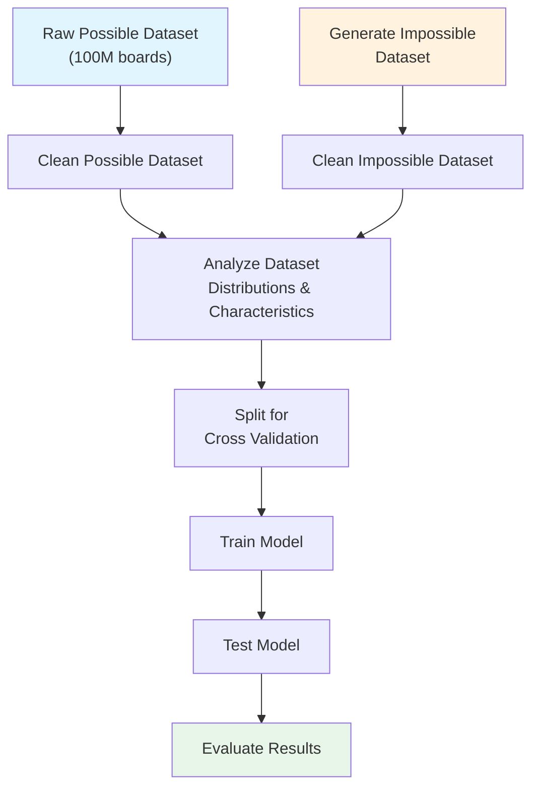

# Simurgh: Chess Position Possibility Classification

## Overview

I know what you are thinking — "oh no, not another chess project." But hear me out. 

While lots of work is dedicated to evaluating positions or legal moves, **I have yet to see a project evaluating possibilities**. 

Chess grandmasters can look at a board and determine whether such a game could exist. Their experience and pattern recognition allow them to assess whether a board state is **possible**. The distinction between **legal** and **possible** is crucial here.

> **Key Insight:** A state can be legal but impossible. For example, a specific pawn structure might follow all the rules of chess, but given the turn number, there's no possible sequence of moves that could produce this arrangement.

**Core Challenge:** Can I create a system that accurately classifies whether a given board state is possible?

---

## Problem Statement

| Aspect | Details |
|--------|---------|
| **Task** | Binary classification - Determine if a chess board state is possible or impossible |
| **Scope** | Identify states that are legal but unreachable (not structural illegality) |
| **Key Inputs** | Board state, Turn number |

---

## Related Work

### Existing Approaches
- **Retrograde Analysis** - Focuses on pawn structure analysis
- **Proof Games** - Generates a history of how a game reached a position (computationally infeasible at scale)
- **Exhaustive Search** - Mathematical methods that search all possible game arrangements (again - computationally infeasible at scale)

### Key Resources
- [Natch Proof Game Solver](http://natch.free.fr/Natch.html)
- [Texel Proof Game Documentation](https://github.com/peterosterlund2/texel/blob/master/doc/proofgame.md)
- [Chess Neural Networks Research](https://theses.liacs.nl/pdf/2022-2023-AlwerSaleh.pdf)
- [Problem Size Estimation](https://univ-avignon.hal.science/hal-03483904)
- [Chess 960 Lichess Dataset](https://www.kaggle.com/datasets/alexmolas/chess-960-lichess) - All back row pieces randomized at start

### Problem Complexity Estimates

| Estimate | Value | Notes |
|---|---|---|
| Shannon's piece-count-respecting estimate | ~4.63 × 10⁴² | Correct piece types, ignores illegality |
| Legal diagrams (upper bound, no promotion) | ~4 × 10³⁷ | Gourion's result |

**Note:** The problem is PSPACE-complete. A learned approximator cuts out the long computational process for each check, making this approach interesting.

---

## Dataset

| Type | Source | Status |
|------|--------|--------|
| **Possible states** | [Hugging Face - 100M Random Chess Boards](https://huggingface.co/datasets/lapp0/100M_random_chess_boards) | ✓ Available |
| **Impossible states** | To be generated | In progress |

### Impossible States Generation

Apply perturbations for each of the envisioned impossibilities.

---

## Predicted Impossibility Types

The system should detect the following types of impossible board states:

1. **Pawn Structure Violation** 
   - Impossible pawn configurations given the move history

2. **State Beyond Turn Number Possibility** 
   - Board state unreachable within the given number of turns

3. **Piece Mobility Violations** 
   - Piece configurations that contradict piece movement rules over time

### Alternative Approaches

A potential alternative is simulated chess variant games.

---

## Endgame & Tablebase Considerations

Chess is solved if 7 pieces or less are left, but there still exist impossible configurations in that range. In the context of tablebases, "illegal positions" are board states that are impossible to reach through legal play from the starting position, even if the individual pieces don't obviously violate any surface-level rules. Here are the main categories:

### Both Kings in Check Simultaneously

A position where both kings are in check at the same time is impossible — only one side moves at a time, so only one king can be left in check after a move. Any such arrangement is excluded outright.

### Side Not to Move Is in Check

If it's White's turn, Black's king cannot be in check, because Black just moved and would never have left their own king in check. Tablebases skip these positions since they couldn't have arisen from a preceding legal move.

### Castling Rights Ambiguity

If the king and rook are still on their starting squares in a 7-piece position, it's ambiguous whether castling rights still exist — we can't know from the position alone if the king or rook moved earlier and returned. Rather than computing two versions of every such position, all castling is simply disregarded and treated as unavailable in tablebases. This means chess with 7 pieces isn't strictly fully solved — positions where castling rights are genuinely active are technically omitted.

### En Passant Ambiguity (Partially Handled)

Similarly, en passant is only legal if the opponent's pawn literally just moved two squares, which is invisible from the static board. For pawnless endgames this is ignored entirely; for positions with pawns, tablebases do account for en passant since it's common enough to matter.

### Endgame Scoring Notes

Need to consider whether to include endgames in the classification scope. Absolute validation set: up to turn 20 synthetic games whose impossibility has been verified by retrograde analysis.

---

## Data Pipeline

---

## Additional Goals

- [ ] Create a web interface for position evaluation
- [ ] Deploy as a hosted website for public access
- [ ] Integrate legal move validation alongside possibility checks