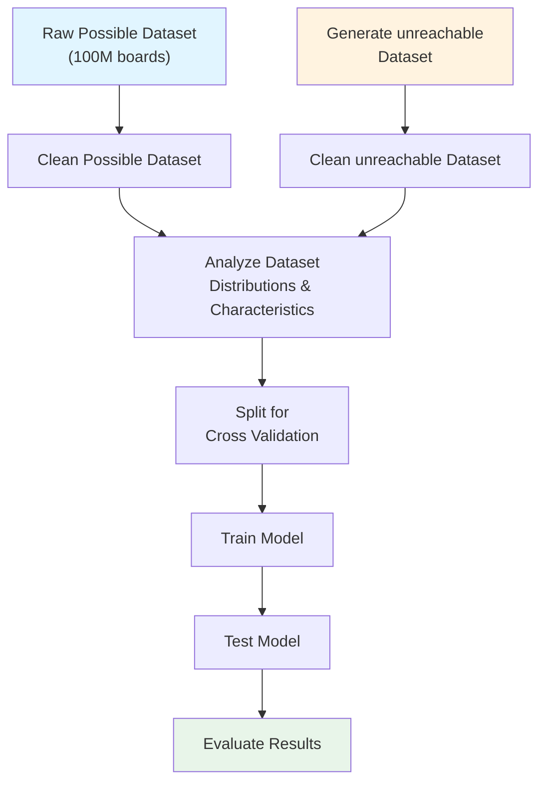

# Simurgh: Chess Position Possibility Classification

## Overview

I know what you are thinking — "oh no, not another chess project." But hear me out. 

While lots of work is dedicated to evaluating positions or legal moves, **I have yet to see a project evaluating possibilities**. 

Chess grandmasters can look at a board and determine whether such a game could exist. Their experience and pattern recognition allow them to assess whether a board state is **possible**. The distinction between **legal** and **possible** is crucial here.

> **Key Insight:** A state can be legal but unreachable. For example, a specific pawn structure might follow all the rules of chess, but given the turn number, there's no possible sequence of moves that could produce this arrangement.

**Core Challenge:** Can I create a system that accurately classifies whether a given board state is reachable?

## Problem Statement

| Aspect         | Details                                                                                                      |
| -------------- | ------------------------------------------------------------------------------------------------------------ |
| **Task**       | Binary classification - Determine if a chess board state is possible or unreachable                          |
| **Scope**      | Identify states that are legal but unreachable (not structural illegality such as improper number of pieces) |
| **Key Inputs** | Board state, Turn number                                                                                     |

---

## Related Work

There exist approaches close to what I'm looking for, most notably- retrograde analysis, where mathematically one searches and computes for a sequence of moves to reach a given board state. However this is not computationally possible beyond around 25 turns. A similar story can be seen on the other end of the spectrum - chess endgames are a mature area of research, and chess is considered "solved" when there are 7 or fewer pieces on the board, that is not to say there do not exist unreachable arrangements with such piece counts, but my paper will not delve into this area, but rather seek to ammend the mid game gap between these two fields.

The problem as a whole is PSPACE-complete. A learned approximator cuts out the long computational process for each check that the standard retrograde analysis methods use.

### Existing Approaches
- **Retrograde Analysis** - Focuses on pawn structure analysis
- **Proof Games** - Generates a history of how a game reached a position (computationally infeasible at scale)
- **Exhaustive Search** - Mathematical methods that search all possible game arrangements (again - computationally infeasible at scale)

### Key Resources
- [Natch Proof Game Solver](http://natch.free.fr/Natch.html)
- [Texel Proof Game Documentation](https://github.com/peterosterlund2/texel/blob/master/doc/proofgame.md)
- [Chess Neural Networks Research](https://theses.liacs.nl/pdf/2022-2023-AlwerSaleh.pdf)
- [Problem Size Estimation](https://univ-avignon.hal.science/hal-03483904)
- [Chess 960 Lichess Dataset](https://www.kaggle.com/datasets/alexmolas/chess-960-lichess) - All back row pieces randomized at start

### Problem Complexity Estimates

We know unreachable boards exist, but just how many are there? Thankfully others have calculated this, giving us a good picture of the scale.

| Estimate                                   | Value        | Notes                                   |
| ------------------------------------------ | ------------ | --------------------------------------- |
| Shannon's piece-count-respecting estimate  | ~4.63 × 10⁴² | Correct piece types, ignores illegality |
| Legal diagrams (upper bound, no promotion) | ~4 × 10³⁷    | Gourion's result                        |

Meaning there are roughly 100 000 times more possible boards than reachable boards

## Dataset

| Type                   | Source                   | Status |
| ---------------------- | ------------------------ | ------ |
| **Possible states**    | download lichess dataset |
| **Unreachable states** | synthetically generated  |

### Unreachable States Generation

Apply perturbations to simulated games for each of the envisioned impossibilities.

## Predicted Impossibility Types

The system should detect the following types of unreachable board states:

1. **Pawn Structure Violation** 
   - unreachable pawn configurations given the move history

2. **State Beyond Turn Number Possibility** 
   - Board state unreachable within the given number of turns

3. **Piece Mobility Violations** 
   - Piece configurations that contradict piece movement rules over time

### Alternative Approaches

A potential alternative is simulated chess variant games. These would naturally tend towards unreachable states, however these is no guarantee that for example a crazyhouse chess game state would not be reachable via normal chess play. So this approach is falling to the way side in terms of priority.

## Data Pipeline

---

## Additional Goals

- [ ] Create a web interface for position evaluation
- [ ] Deploy as a hosted website for public access
- [ ] Integrate legal move validation alongside possibility checks